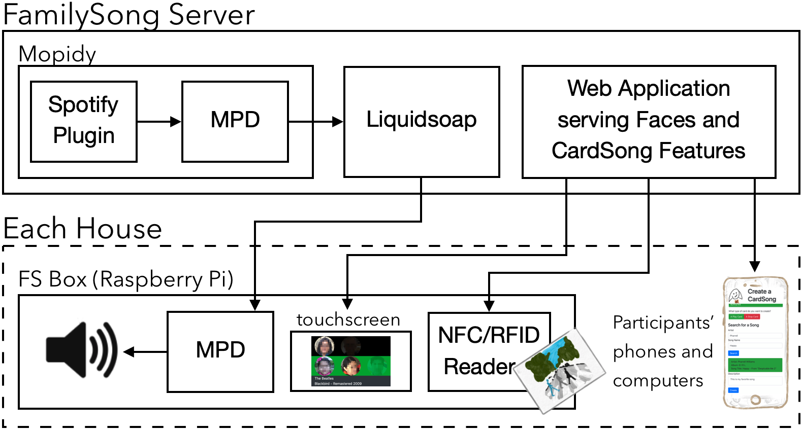
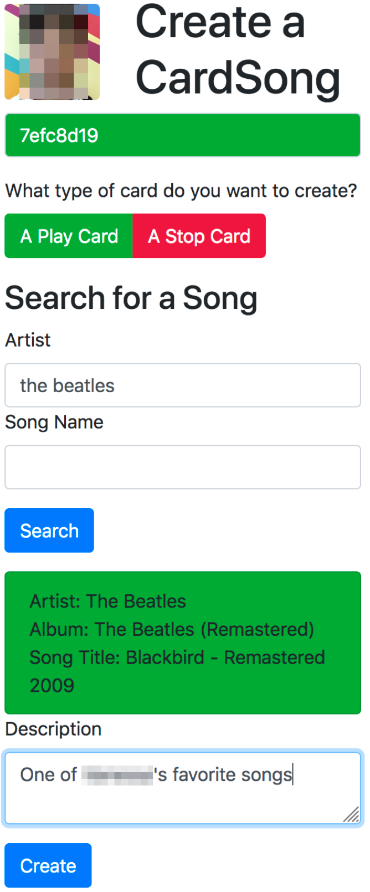

+++
title = "FamilySong: System Architecture"
date = 2026-03-18T00:00:00-05:00
weight = 2
tags = ["full-stack", "Node.js", "Docker", "Raspberry Pi", "IoT", "WebSockets"]
description = "How I designed and built the software and hardware stack behind FamilySong — from Raspberry Pi clients to Dockerized per-family servers."
# draft = true

# [cover]
# image = "../familysong/images/p3_arch.png"
# alt = "FamilySong system architecture diagram"
# relative = true
+++

I was the sole engineer on FamilySong. Over 3 years, I built every layer of the system — from soldering GPIO pins to managing Docker containers in production — growing it from a single Raspberry Pi playing MP3s into a networked platform serving 6 families across 12 households.

This article covers the system design and the practical engineering decisions behind it. For the design research story, see the [main FamilySong case study](/projects/familysong/).

## The Problem, Architecturally

FamilySong needed to let family members in different households — sometimes on different continents — share music in near-real-time by tapping physical cards on a box. That means:

- **Physical devices** in each home that are always on, reliable, and usable by anyone from toddlers to grandparents
- **A server** that interprets card taps, manages song queues, and coordinates playback across households
- **Audio streaming** that keeps all boxes in a family roughly in sync
- **A card creation interface** that lets participants assign songs to NFC cards without technical knowledge
- **Months of unattended operation** in homes I couldn't easily visit

No single off-the-shelf system did this. I had to stitch together hardware, open-source audio tools, a custom server, and a web interface — then keep it all running reliably in the real world.

## System Overview

Each family got its own isolated server stack. Each household in that family got a Raspberry Pi box. Here's how they fit together:

<figure>

<figcaption>Architecture of the final FamilySong system. Each family runs an independent containerized stack on the server; each household connects a Raspberry Pi client.</figcaption>
</figure>

### The Server (Per-Family, Dockerized)

Each family's backend ran as three [Docker](https://www.docker.com/) containers orchestrated with [docker-compose](https://docs.docker.com/compose/), all hosted on a single Ubuntu Server VM in Virginia Tech's CS department cluster:

**[Node.js](https://nodejs.org/) application** — the brain of the system. It handled:

- [WebSocket](https://developer.mozilla.org/en-US/docs/Web/API/WebSockets_API) connections from every Pi in the family
- Card tap interpretation: is this a song card, a command card (pause, clear queue), or an unregistered card?
- Dispatching playback commands to Mopidy
- Serving the card creation web interface
- Logging all events (taps, playback state changes, face interactions) to a shared research database

**[Mopidy](https://mopidy.com/) + [MPD](https://www.musicpd.org/)** — handled song queuing, [Spotify](https://developer.spotify.com/) library access, and playback control. The Node.js server sent commands to Mopidy's API, which managed the playback queue through MPD. This container also included Mopidy's web interface for debugging and manual control.

**[Liquidsoap](https://www.liquidsoap.info/)** — consumed MPD's audio output and encoded it as an HTTP MP3 stream, one per family, accessible to all that family's Pi clients.

Each family's stack was fully independent. A problem in one family's containers never affected another. Docker-compose made spinning up a new family straightforward: configure the environment, bring up the stack, point the household Pis at it.

A single shared [MySQL](https://www.mysql.com/) database across all families collected anonymized event data for research analysis. In practice, the most valuable table ended up being a simple event log — each row storing a serialized JSON payload with all relevant IDs and metadata. If I were to do it again, I'd use a document database like [MongoDB](https://www.mongodb.com/) for event logging, since the schema naturally evolved toward unstructured data.

### The Raspberry Pi Client

Each household got a Raspberry Pi running Raspbian, configured to boot automatically on power-up into a working state with no manual intervention. The Pi was intentionally kept simple — a thin client, not a smart one.

**Hardware:**

- [Raspberry Pi](https://www.raspberrypi.com/) (headless except for the touchscreen)
- [Adafruit PiTFT 2.8" capacitive touchscreen HAT](https://www.adafruit.com/product/2423)
- [Adafruit PN532 NFC/RFID breakout board](https://www.adafruit.com/product/364) (or compatible boards with the same chip), connected via GPIO
- DROK PAM8406 5W+5W stereo amplifier board, fed from the Pi's 3.5mm audio jack and powered by the same 5V USB supply
- Pair of stereo speakers

**Software:**

- **Faces interface** — a [Tkinter](https://docs.python.org/3/library/tkinter.html) GUI displaying a 2x3 grid of face buttons, each toggling between colored and grey. Faces were synchronized across all devices in a family, acting as an ambient presence signal.
- **RFID listener** — continuously polled the NFC reader and forwarded card IDs to the server over WebSocket.
- *(In practice, both ran as a single Python application sharing one WebSocket connection — simpler than managing two daemons with separate connections.)*
- **[MPD](https://www.musicpd.org/)** — connected to the family's Liquidsoap HTTP stream as input, output routed to the speakers through the amplifier.
- **[PM2](https://pm2.keymetrics.io/)** — managed all local processes and ensured they started on boot.
- Periodic scripts that resubscribed MPD to the audio stream, clearing buffers to maintain sync (more on this below).

### The Card Creation Interface

<figure style="float: right; width: 30%; margin: 0 0 1em 1.5em;">

<figcaption>The card creation interface, used by participants to assign songs to NFC cards.</figcaption>
</figure>

Each user had a unique URL pointing to a web interface served by their family's Node.js instance. The flow:

1. Open the URL — see a prompt: "Place a card on your box"
2. Place an NFC card — the interface detects it via the Pi's RFID reader → WebSocket → server, and displays the card's ID
3. If the card is already assigned, show its current song and offer to update it
4. If it's new, choose: **Play Card** or **Stop Card**
5. For Play Cards: search for a song by artist/title, pick from results, optionally write a short note about why you chose it ("this is grandma's favorite")
6. Hit create — the association is stored server-side
7. Lift the card, tap it on the box to test, then go decorate it

This physical-digital loop — configure on screen, test on the box, then personalize with markers and stickers — was central to making CardSongs feel like something families owned rather than just a playlist with extra steps.

## The Hardest Engineering Problem: Stream Synchronization

The whole point of FamilySong is that family members experience music *together* across distance. That means the audio stream needs to be reasonably in sync across all boxes in a family.

This turned out to be the hardest problem in the system.

MPD and Liquidsoap both maintain internal buffers, and the HTTP streaming protocol introduces additional latency that varies with network conditions. During testing, I found that boxes could drift apart by as much as several minutes, especially after periods of silence when buffers weren't being actively flushed.

I tried many approaches to tighten synchronization. The most effective was periodically clearing MPD's connection to the stream and resubscribing, which flushed stale buffers. This was never perfect — the result was a typical asynchrony of about 2 seconds, with occasional drift up to 10 seconds.

Here's what made this problem interesting from a design perspective: **it turned out not to matter much.** Through interviews and observation during the deployment, families reported feeling like they were listening together even with noticeable delay. The shared experience wasn't about hearing the exact same beat at the exact same millisecond — it was about knowing your family member chose this song, right now, and you're both hearing it. When families jumped on a video call, they'd sometimes notice the offset, but by then the activity had shifted from shared listening to conversation. They knew from experience that FamilySong wasn't for sing-alongs — it was for connection.

This was a lesson in knowing when "good enough" is the right engineering target. I could have spent months chasing tighter sync. Instead, the research showed that the experience held up, and I focused engineering effort elsewhere.

## Keeping It Running: Reliability in the Real World

These boxes lived in families' homes for months. I couldn't walk over and fix them. Reliability wasn't a feature — it was a survival requirement.

**Defensive design on the Pi:**
- Disabled filesystem journaling to minimize SD card writes — the most common Raspberry Pi failure mode. No SD card corrupted during the entire 3-year deployment.
- All logging happened server-side. The Pi wrote almost nothing to disk during normal operation.
- PM2 ensured all processes restarted on boot. Families could power-cycle their box to fix most issues, and the Pi would come back up in a working state within about a minute.

**Remote access:**
- Each Pi maintained an SSH tunnel through [remote.it](https://remote.it), giving me remote access regardless of the household's network configuration (NAT, firewalls, etc.).
- When a participant reported an issue via WhatsApp, I could SSH in, check process status, and usually fix it with a service restart or reboot — without asking them to do anything technical.

**Server-side resilience:**
- Docker-compose made it straightforward to restart a family's stack without affecting others.
- The server was largely agnostic to client-side errors. If a Pi disconnected, the server continued serving the stream and handling taps from other boxes in that family. When the Pi reconnected, it just picked up the stream again.

## What I'd Do Differently

If I were building this system today:

- **Rethink the audio pipeline.** The buffer synchronization problem stemmed from chaining three audio tools (MPD, Mopidy, Liquidsoap) that each maintained their own state. Today, I'd explore having each client engage with Spotify directly rather than re-streaming through a central server. This would simplify the architecture and avoid potential Terms of Service concerns — something we were mindful of, though as a not-for-profit research project it wasn't a blocking issue. That said, Spotify and similar services have made it increasingly difficult to programmatically search their catalog or manipulate playback queues, so this tradeoff comes with its own constraints.
- **Use a configuration management tool** for the Pis. I set up each Pi manually with scripts and documentation. Something like [Ansible](https://www.ansible.com/) or [balena](https://www.balena.io/) would have made fleet management less error-prone.

## Tech Stack Summary

| Layer | Technology |
|-------|-----------|
| Client hardware | Raspberry Pi, stereo amplifier, NFC/RFID reader, touchscreen |
| Client software | Python (Tkinter), MPD, PM2, remote.it |
| Server | Node.js, WebSockets, Mopidy, MPD, Liquidsoap |
| Infrastructure | Docker, docker-compose, Ubuntu Server VM (Virginia Tech CS) |
| Data | MySQL, server-side event logging |
| External services | Spotify (via Mopidy), remote.it (SSH tunneling) |
