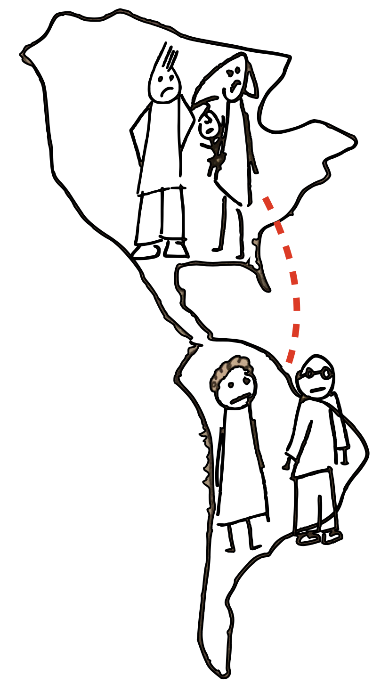
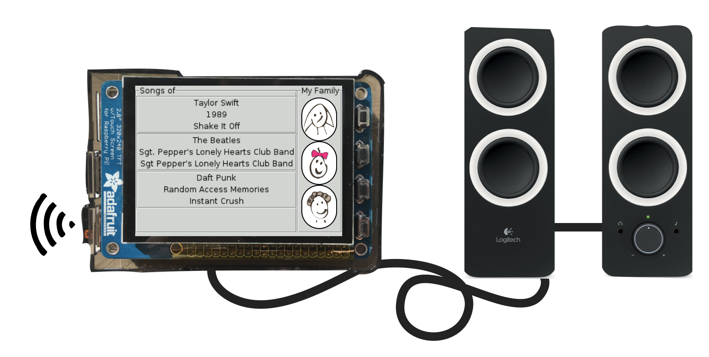
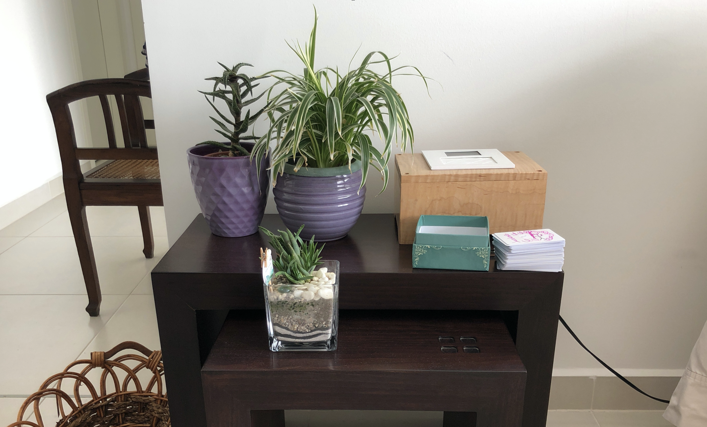
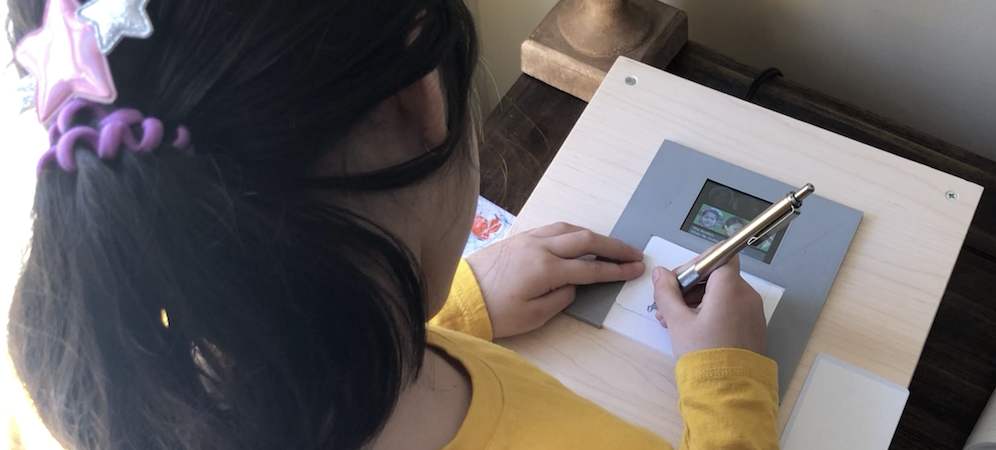
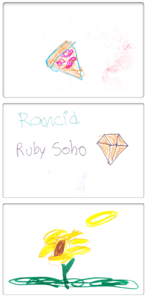
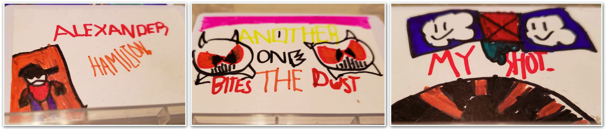

+++
title = "FamilySong"
date = 2026-03-03T00:00:00-05:00
lastmod = 2026-03-18T00:00:00-05:00
description = "Designing, building, and deploying networked music boxes that helped 6 families across 12 households stay connected through shared music."

[cover]
image = "images/family.png"
alt = "Illustration of parents, child, and grandparents connected across distance"
relative = true
+++

<nav>
  <ul>
    <li><a href="#tldr">Overview</a></li>
    <li><a href="#problem">When Video Calls Are Not Enough</a></li>
    <li><a href="#approach">From Observation to Design</a></li>
    <li><a href="#tensions">Design Tensions</a></li>
    <li><a href="#iterations">Iterations</a></li>
    <!-- <li><a href="#system">System Overview</a></li>
    <li><a href="#deployment">In-Home Deployment</a></li> -->
    <li><a href="#insights">Key Insights</a></li>
  </ul>
</nav>

---

## Overview {#tldr}

FamilySong is a set of networked music boxes that let families living in different countries share music in real time. Songs are represented as CardSongs — tangible cards that anyone can place on the box to start a song in both homes simultaneously. CardSongs empower even pre-verbal children with the agency to choose music for themselves and their family, creating opportunities for expression and connection with grandparents thousands of miles away.

I owned the entire project end to end — user research, interaction design, hardware prototyping (Raspberry Pi, NFC, custom wood enclosures), full-stack software (Node.js, WebSockets, streaming infrastructure), and in-home deployments with 6 families across 12 households over 2.5 years. The project explored how shared musical experiences can support personal connection, cultural continuity across generations, and everyday family life. Published at ACM DIS 2019, a top peer-reviewed conference for interaction design.

## When Video Calls Are Not Enough {#problem}

<figure style="float: right; max-width: 200px; margin: 0 0 1em 1em;">

<figcaption>
Families separated by distance, connected only by a thin line.
</figcaption>

</figure>

When my wife and I moved to the United States, our daughter Emma was just over a year old. Her grandparents lived about 4,000 kilometers away, and video calls quickly became a regular part of our family routine.

At first, these calls felt like extending a lifeline to them. They allowed Emma's grandparents to see her grow, hear her voice, and they opened a window into everyday moments of her life. But we soon noticed something many families experience: video calls with very young children rarely last very long.

Emma would lose interest quickly. Her grandparents would try to talk to her, but she did not yet have the language skills, interest, or attention span to sustain a conversation. What began as excited greetings would often fade into awkward pauses as the adults tried, unsuccessfully, to keep her engaged.

One solution was to make the conversation more interesting. For example, the grandparents began inventing small activities such as a bilingual object-naming game, showing Emma toys and household objects on camera and asking her to name them in English and Spanish.

<figure>

<figcaption>
Everyday objects that became part of the bilingual naming game during video calls.
</figcaption>

</figure>

Another pair of grandparents discovered that Emma enjoyed singing nursery rhymes. They began teaching her the Spanish versions of songs she was already learning in English.

These moments worked surprisingly well. Songs and games created shared experiences that bridged the distance between homes through repetitive, relaxed, but focused activities.

But they also revealed an important limitation.

When Emma and her grandmother tried to sing together over video, the delay in the connection made it nearly impossible. The voices would fall out of sync. The adults would stop singing. And Emma, even more quickly, would stop as soon as she heard the mismatch.

That moment stayed with me.

It made me realize that the problem wasn’t simply video quality or connection speed. The problem was that **the technology we were using was designed for conversation**, while our most **meaningful connections were emerging through shared experiences**. Emma was, of course, a child, but even for adults, a video call generally means everyone is focused on the conversation itself. But family life is much richer than this.

Music was one of the clearest examples of this tension.

## From Observation to Design {#approach}

Singing together had highlighted something important: music created a structure that allowed Emma to participate even when language and attention were limited. But it also required coordination, and even small delays in the network disrupted that shared rhythm.

Around this time I was also discussing these challenges with my colleague [Michael Stewart](https://www.jmu.edu/cise/people/faculty/stewart-michael.shtml), who was developing his dissertation project *[CoListen](https://thirdlab.cs.vt.edu/mediated-life/togetherness/)*. His work explored shared music listening for school-aged kids in different places. While our contexts and design constraints were quite different, our conversations often revolved around a similar question: how music might act as a medium for connection across distance. Those discussions helped sharpen my thinking about what role music could play in supporting family relationships at a distance.

I began exploring the question of how to design **shared musical experiences across distance that were synchronous enough to feel meaningful without requiring conversational real-time coordination.** In this vision, whether in the background or the foreground, **music becomes the medium through which families maintain awareness and connectivity.** Conversation can follow.

At this stage, I began experimenting with simple prototypes that could allow music to be shared between homes in ways that were lightweight, playful, and easy for both adults and children to use.

My thinking was also informed by earlier research on remote presence — systems that used always-on video, ambient audio, or shared photo streams to create a sense of togetherness between distant homes. These projects showed the value of feeling connected across distance, but they also tended to be intrusive or require constant attention. FamilySong explored a different direction: shared musical activity that could live comfortably alongside everyday life.

## Design Tensions {#tensions}

As I began exploring early prototypes, several design tensions became apparent — some from practical concerns within my own family’s experience, others from limitations I saw in existing systems. These tensions guided the design decisions that followed.

### Foreground Interaction vs Background Presence

Many existing systems for shared music required a computer or phone to be actively dedicated to the experience. Applications like Michael Stewart’s *CoListen* or other shared-listening systems often depended on someone intentionally opening an application and keeping it running. While this approach works well for focused interaction, it introduces a practical burden in everyday family life.

Parents are often juggling multiple responsibilities, and expecting them to dedicate a device solely to shared music can make the interaction fragile. I also realized that I personally would not want to give up my laptop or phone just to maintain a musical connection with another home.

This tension suggested an important design direction: the interaction should be able to **coexist with everyday activity**, allowing people to work, talk, or do other things while the shared musical experience unfolded in the background.

### Connection vs Intrusion

The remote presence systems I described earlier — always-on video, ambient audio — often succeed in creating awareness, but they can also be intrusive. Continuous streams make people visible and audible in ways that may disrupt normal household life. One of the central questions guiding FamilySong became how to preserve a sense of **togetherness across distance without introducing that level of intrusion**.

Music offered a promising middle ground. Unlike live video or conversation, music can exist comfortably in the background of domestic life while still creating a shared experience between homes.

### Coordination vs Effortless Participation

Video calls and many synchronous systems depend on explicit coordination. Both sides must be present at the same time, ready to engage in the interaction. With young children, this requirement often makes the interaction fragile.

The early design challenge for FamilySong therefore became finding ways to reduce the need for coordination while still allowing families to experience music together. Rather than scheduling shared moments, the system needed to allow those moments to **emerge naturally within the rhythms of everyday life**.

## Iterations {#iterations}
### Prototype 1 — Testing the Technology

**Impetus**

The first goal was to determine whether the core idea was technically feasible: could music be triggered in one home and reliably played in another?

The first working prototype consisted of two Raspberry Pi computers placed in my home and my parents’ home overseas. Each Pi was connected to speakers already present in the household using a standard 3.5 mm audio connection. The devices ran Music Player Daemon (MPD) with a browser-based MPD interface, and each Pi contained a local copy of roughly twenty albums—primarily classical music and The Beatles.

To coordinate playback between homes, I implemented a small NodeJS server using WebSockets. When a song was selected, the server broadcast instructions that lightweight clients on each Raspberry Pi translated into MPD commands such as play or queue.

<figure>

<figcaption>
The first prototype — a Raspberry Pi with a touchscreen, connected to existing household speakers over Wi-Fi.
</figcaption>

</figure>

**What this prototype explored**

- Whether two distant homes could reliably share music playback  
- How MPD players could be coordinated through a lightweight server  
- Whether slightly imperfect synchronization could still feel synchronous enough to support a shared musical experience  

**Lessons learned**

Technically, the prototype worked. Music could be triggered in one home and played in the other. The playback was not perfectly synchronized—the two systems typically drifted by about three seconds—but this delay did not appear to break the shared listening experience. Instead, it still seemed synchronous enough for families to experience the music as something they were sharing together across homes.

More significant limitations quickly emerged elsewhere. Because each Raspberry Pi stored its own local music catalog, expanding or updating the song library remotely proved difficult. Managing and synchronizing music collections across homes did not scale well.

Observing how the system was used also revealed an interaction issue. In this early stage, I made all music selections from my phone using the MPD interface. While workable for testing, this setup concentrated control in a single device and person. It quickly became clear that the system would need to **distribute both the burden and the agency of choosing music across households**.

At the same time, the prototype confirmed several effects we had intentionally designed for. Even with imperfect synchronization and a very limited music catalog, families responded to the experience of hearing the same music in two distant homes. The music itself became a **shared signal** connecting the two environments — creating a subtle sense of being in the same place across distance.

These observations reinforced the value of using **dedicated FamilySong devices** rather than relying on an adult’s phone or computer.

### Prototype 2 — Expanding Access and Exploring Interaction

**Impetus**

The first prototype worked, but it revealed two limitations: the interaction depended too heavily on one person selecting music from a phone, and maintaining identical music libraries on both Pis didn't scale. This iteration aimed to fix both — moving control closer to the devices themselves and replacing local catalogs with a shared streaming source — while also broadening the study to more families.

In retrospect, this prototype produced mixed results. While it significantly improved the technical infrastructure of the system, several of the interaction experiments proved less successful.

**What this prototype explored**

One experiment during this stage involved adding a small 2–3 inch touchscreen to the Raspberry Pi devices. The idea was to allow music selection directly on the FamilySong device, removing the need for participants to open an interface on their phones.

In practice, the screen was far too small to support meaningful browsing of a music catalog. At most, the interface could comfortably display the current song and provide simple controls such as **previous**, **next**, **pause**, or **repeat**. As a result, adults continued to rely on their phones for music selection, though the interface for accessing the selection system was made easier to reach.

While the touchscreen did not succeed as a browsing interface, it did prove useful for lightweight playback controls. Anyone in the household could pause, skip, or repeat songs directly on the device.

The devices also began displaying small photos representing members of the other household as lightweight **presence indicators**, intended to provide a subtle reminder of who was connected on the other side. Participants interacted with these only occasionally, though one child in the study found them particularly amusing.

On the technical side, this iteration introduced a much more scalable architecture for music distribution. Instead of maintaining identical local music libraries, the system integrated a **Spotify subscription**, giving participants access to a far larger catalog of music.

Music was streamed through **Liquidsoap**, an internet-radio software system that generated a private stream shared between homes. Each Raspberry Pi simply subscribed to this stream using MPD, which made the client devices extremely lightweight.

**Lessons learned**

The touchscreen experiment revealed that simply adding a graphical interface to the devices did not necessarily improve the interaction. Small screens made browsing music frustrating, and participants continued to rely on their phones for discovery and selection. However, the screen did work well for simple playback actions such as pausing or skipping songs.

The new streaming architecture successfully solved the catalog management problem but introduced a different technical challenge. Because the Raspberry Pis received the stream through independent buffers, playback between homes would sometimes drift out of synchronization.

In practice, the streams typically differed by roughly **2–10 seconds**. Participants did not appear to find this particularly disruptive, and we eventually implemented simple mechanisms to reset the clients and clear their buffers to bring the streams back into rough alignment.

More importantly, this iteration reinforced a key design insight: perfect synchronization was less important than whether the experience still felt **synchronous enough to support hearing the same music across homes together**. Even with small temporal differences, participants still experienced the system as a shared musical environment connecting the two households.

### Prototype 3 — Giving Children Agency

**Impetus**

While earlier iterations improved the technical infrastructure of the system, they still depended largely on adults to initiate the shared musical experience. In practice, this meant that moments of connection often began with an adult opening a phone interface and choosing a song.

For very young children, this limited their ability to participate meaningfully in starting those interactions.

The goal of this third prototype was therefore to explore how the system could give **young children direct agency** in selecting and sharing music between homes while further reinforcing the idea that FamilySong should exist as a standalone object in the home rather than as another application running on a personal device. Instead of relying on screens or mobile interfaces, this iteration focused on tangible interaction that children could understand and manipulate as part of everyday play.

**What this prototype explored**

This iteration introduced a pair of **tangible music boxes**, one placed in each household. Unlike earlier prototypes that relied on existing speakers and lightweight Raspberry Pi setups, this version of the system was designed as a complete standalone artifact that could comfortably live within the home.

Each box contained a Raspberry Pi, an RFID reader positioned on the top surface with clear affordances for placing the CardSongs, a small touchscreen used for lightweight controls and presence indicators, and a pair of reasonably good speakers. A physical volume knob was included but intentionally placed somewhat out of view so that the device retained the feel of a simple household object rather than a piece of exposed technology.

<figure style="max-width: 500px; margin: 1em auto;">

<figcaption>
Early concept sketches for CardSongs — hand-drawn designs for songs familiar to our family.
</figcaption>

</figure>

I also designed and built bespoke enclosures for the devices using locally sourced hardwood combined with several 3D-printed components. The goal was to create objects that families could comfortably place in shared spaces such as a living room or coffee table. Rather than looking like experimental hardware, the boxes were meant to resemble domestic artifacts that naturally blended into the home.

<figure>

<figcaption>
A FamilySong box in a participant's living room, with CardSongs stacked beside it.
</figcaption>

</figure>

**Lessons learned**

Introducing tangible interaction significantly changed how the system was used.

Children who had previously been passive listeners began actively initiating songs themselves. In many cases, they treated the music box less like a technological device and more like a toy integrated into their daily routines.

<figure>

<figcaption>
Emma drawing on a CardSong while it plays on the FamilySong box.
</figcaption>

</figure>

This change also shifted the role of adults. Instead of acting as gatekeepers who controlled music selection through phones or computers, adults became participants in musical moments that children could initiate.

During later video calls between families, participants suddenly had shared experiences to talk about: songs that had been played earlier in the day, drawings children had made on the CardSongs, or moments when music unexpectedly appeared in the other household. In this sense, the most powerful effect of the system was often not visible during direct use, but in the conversations and stories that emerged afterward.

<!-- --- -->
> “Later on the video call we would say, ‘We heard you playing that song earlier!’
> Suddenly we had something to talk about.”
>
> — Grandparent participant
<!-- --- -->

Rather than competing with the many activities and technologies already filling everyday home life, FamilySong was designed to exist quietly alongside them. Music could appear in the background while people continued cooking, playing, working, or simply moving through their routines — no one had to stop what they were doing. In this sense, FamilySong attempted to recover something that many families once experienced through broadcast media such as live television or radio: shared cultural moments that later became topics of conversation. Instead of requiring explicit coordination, it let those moments emerge naturally through music, creating opportunities for serendipitous connection — so that when families later connected through video calls, they already had something to talk about.

<!-- ## System Overview {#system}

The full technical architecture of FamilySong — including the Raspberry Pi hardware design, RFID token system, streaming infrastructure, and coordination server — is described in a separate technical deep-dive.

This case study focuses primarily on the design journey and the interaction insights that emerged from the project.

→ **Work in progress:** [Building the FamilySong System](#) -->

<!-- ## In-Home Deployment {#deployment}

Details about the multi-family in-home deployment — including how families were recruited, how long the devices were used in each home, and what daily usage patterns emerged — will be documented in a separate article.

→ **Work in progress:** [Deploying FamilySong in Real Homes](#) -->

<figure>

<figcaption>
System architecture for the final prototype — Raspberry Pi devices, streaming infrastructure, and coordination server.
</figcaption>

</figure>

## Key Insights {#insights}

Looking across the full design journey, FamilySong revealed several insights about how technology can support connection in families living far apart.

### Passive Shared Experiences Can Create Shared Narratives

<figure style="float: left; max-width: 175px; margin: 0 1em 1em 0;">

<figcaption>
CardSongs decorated by a participant family — each card became a personal, meaningful artifact.
</figcaption>

</figure>

Existing tools for connecting families across distance tend to focus on structured, one-on-one activities — a grandparent reading to a child, a parent playing a game remotely. These work well, but they target a single relationship at a time.

FamilySong explored a different but complementary possibility: that passive shared experiences could connect an entire family, not just one pair at a time. Different people engaged with the music with different intentions, levels of attention, and emotional stakes — and that was fine. By hearing the same music in different homes—even without direct coordination—families developed shared reference points, stories, and later conversations that extended beyond the moment of listening itself.

In this sense, FamilySong did not only affect one relationship at a time. The shared musical moments could simultaneously shape interactions between children and grandparents, parents and their in‑laws, and the family as a whole.

### Connection Can Grow in the Background

FamilySong suggested that meaningful connection does not always require focused interaction. Instead of demanding attention like a phone call or video chat, the system was designed to live quietly in the background of everyday life. Music could appear while people cooked, worked, played, or moved through their routines without requiring anyone to stop what they were doing.

Rather than acting as a primary communication channel, FamilySong created small shared moments that later resurfaced in conversations between homes. We sometimes compared this effect to *umami*: not the main flavor in the meal, but an element that intensifies and enriches everything around it.

### Family Technologies Work Best When They Complement Existing Communication Habits

FamilySong suggested that technologies for family connection work best when they build on communication practices that families already value. From the beginning, the system was designed to work alongside tools such as WhatsApp, Facebook, FaceTime, and video calls rather than replace them. This proved essential. **Some of the most meaningful outcomes of the system were not visible during direct use, but emerged later when families connected through those other channels** and suddenly had something new to talk about, sing about, or remember together.

### Tangible Artifacts Can Make Connection Physical

The music boxes and CardSongs were not only interfaces; they became meaningful domestic artifacts. Families decorated, reused, and cared for them in ways that reflected ownership, affection, and memory.

<figure>

<figcaption>
CardSongs from another family — Hamilton, Queen, and Eminem alongside hand-drawn illustrations.
</figcaption>

</figure> Designers call this *reification* — turning an abstract relationship into something concrete you can see, touch, and care for. FamilySong gave distant relationships exactly that: a material presence in the home.

During early deployments in my parents’ home, my father—one of the first participants—likened music to taste and smell: sensory experiences that become powerful carriers of memory, capable of recalling people, places, and moments across decades. FamilySong suggested that music, objects, and small rituals can work together in a similar way. The boxes and CardSongs do not merely support interaction; they **give families something to keep, personalize, and cherish** as part of their everyday lives.

### Designing for Children's Agency Can Strengthen the Whole Family System

When children were able to initiate music for themselves, they did not simply gain control over playback. They became active participants in sustaining the connection between homes. These small acts of agency allowed children to trigger shared moments that grandparents could recognize and interpret, often giving those interactions a meaning that extended beyond the music itself.

For several grandparents—many in their seventies or eighties—these moments carried particular emotional weight. According to both them and their adult children, the interactions became one of the few ways they felt they could convey pieces of culture, language, and identity to grandchildren growing up in a very different environment. Over time, some children even began associating particular songs with specific relatives—moments like saying *"this is grandpa's song"*—turning the music into a small but meaningful thread connecting generations across distance.