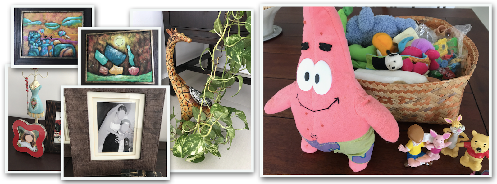

+++
title = "FamilySong"
date = 2026-03-03T00:00:00-05:00
# draft = true
description = "Designing a tangible, asynchronous music-sharing system for internationally distributed families."
+++

<nav>
  <ul>
    <li><a href="#tldr">TL;DR</a></li>
    <li><a href="#problem">When Video Calls Stop Working</a></li>
    <li><a href="#approach">From Observation to Design</a></li>
    <li><a href="#tensions">Design Tensions</a></li>
    <li><a href="#iterations">Iterations</a></li>
    <li><a href="#system">System</a></li>
    <li><a href="#deployment">Deployment</a></li>
    <li><a href="#insights">Insights</a></li>
  </ul>
</nav>

---

## TL;DR {#tldr}

FamilySong is a tangible music-sharing system designed to help geographically distributed families stay connected through shared musical experiences. I designed and built a set of networked music boxes that allowed families in different homes to play music together asynchronously. Through multiple prototypes and in-home deployments with real families, the project explored how music can support connection when conversation breaks down—especially for young children.

## When Video Calls Stop Working {#problem}

When my wife and I moved to the United States, our daughter Emma was just over a year old. Her grandparents lived about 4,000 kilometers away, and video calls quickly became a regular part of our family routine.

At first, these calls felt like extending a lifeline to them. They allowed Emma's grandparents to see her grow, hear her voice, and they opened a window into everyday moments of her life. But we soon noticed something many families experience: video calls with very young children rarely last very long.

Emma would lose interest quickly. Her grandparents would try to talk to her, but she did not yet have the language skills, interest, or attention span to sustain a conversation. What began as excited greetings would often fade into awkward pauses as the adults tried, unsuccessfully, to keep her engaged.

Over time, the grandparents began inventing small activities to make the calls more engaging. One pair of grandparents started a bilingual object-naming game, showing Emma toys and household objects on camera and asking her to name them in English and Spanish.

<!-- 

*Everyday objects that became part of the bilingual naming game played during video calls.* -->

<figure>

<figcaption>
Everyday objects that became part of the bilingual naming game during video calls.
</figcaption>

</figure>

Another pair of grandparents discovered that Emma enjoyed singing nursery rhymes. They began teaching her the Spanish versions of songs she was already learning in English.

These moments worked surprisingly well. Songs and games created shared experiences that bridged the distance between homes through repetitive, relaxed, but focused activities.

But they also revealed an important limitation.

When Emma and her grandmother tried to sing together over video, the delay in the connection made it nearly impossible. The voices would fall out of sync. The adults would stop singing. And Emma, even more quickly, would stop as soon as she heard the mismatch.

That moment stayed with me.

It made me realize that the problem wasn’t simply video quality or connection speed. The problem was that **the technology we were using was designed for conversation**, while our most **meaningful connections were emerging through shared experiences**.

Music was one of the clearest examples of this tension.

## From Observation to Design {#approach}

The breakdown during those singing moments made it clear that the problem was not simply a technical one. Video calls were doing exactly what they were designed to do: enable conversation. But from my perspective as a participant and observer in these calls, the interactions that generated the most engagement between Emma and her grandparents were not conversations at all. They were small, shared activities that created moments of connection.

Singing together highlighted this tension. Music created a structure that allowed Emma to participate even when language and attention were limited. But music also required coordination, and even small delays in the network disrupted that shared rhythm.

Around this time I was also discussing these challenges with my colleague [Michael Stewart](https://www.jmu.edu/cise/people/faculty/stewart-michael.shtml), who was developing his dissertation project *[CoListen](https://thirdlab.cs.vt.edu/mediated-life/togetherness/)*. His work explored synchronous shared music experiences between school‑aged children in different locations. While our contexts and design constraints were quite different, our conversations often revolved around a similar question: how music might act as a medium for connection across distance. Those discussions helped sharpen my thinking about what role music could play in supporting family relationships at a distance.

Rather than trying to improve video calls or reduce latency—problems that were technically beyond my ability to solve—I began exploring a different question: What would it look like to design for **shared musical experiences across distance without requiring real‑time coordination?**

This shift reframed the problem entirely. Instead of focusing on communication technologies designed for talking, the goal became designing **a system where music itself could become the medium through which families stayed connected.**

At this stage, I began experimenting with simple prototypes that could allow music to be shared between homes in ways that were lightweight, playful, and easy for both adults and children to use.

My thinking was also informed by earlier research exploring mediated presence in distributed relationships. Projects such as **Media Spaces** (Harrison), **MissU** (Lottridge), and **FamilyWindow** (Judge) showed how technologies can create a sense of togetherness across distance. These works provided important inspiration, even as FamilySong began exploring a different design direction centered on shared musical activity rather than ambient audio or video presence.

## Design Tensions {#tensions}

As I began exploring early prototypes, several design tensions became apparent. These tensions emerged both from practical concerns within my own family’s experience and from questions raised in earlier research on mediated presence. Together, they helped define the space of possible solutions and guided many of the design decisions that followed.

### Foreground Interaction vs Background Presence

Many existing systems for shared music required a computer or phone to be actively dedicated to the experience. Applications like Michael Stewart’s *CoListen* or earlier systems such as *MissU* often depended on someone intentionally opening an application and keeping it running. While this approach works well for focused interaction, it introduces a practical burden in everyday family life.

Parents are often juggling multiple responsibilities, and expecting them to dedicate a device solely to shared music can make the interaction fragile. I also realized that I personally would not want to give up my laptop or phone just to maintain a musical connection with another home.

This tension suggested an important design direction: the interaction should be able to **coexist with everyday activity**, allowing people to work, talk, or do other things while the shared musical experience unfolded in the background.

### Connection vs Intrusion

Research on Media Spaces has long explored how technology can create a sense of presence between distant locations. These systems often succeed in providing awareness and connection, but they also raise a persistent challenge: they can be intrusive.

Continuous video or audio streams make people visible and audible in ways that may disrupt normal household activities. One of the central questions guiding FamilySong became how to preserve a sense of **togetherness across distance without introducing that level of intrusion**.

Music offered a promising middle ground. Unlike live video or conversation, music can exist comfortably in the background of domestic life while still creating a shared experience between homes.

### Coordination vs Effortless Participation

Video calls and many synchronous systems depend on explicit coordination. Both sides must be present at the same time, ready to engage in the interaction. With young children, this requirement often makes the interaction fragile.

The early design challenge for FamilySong therefore became finding ways to reduce the need for coordination while still allowing families to experience music together. Rather than scheduling shared moments, the system needed to allow those moments to **emerge naturally within the rhythms of everyday life**.

## Iterations {#iterations}
### Prototype 1 — Testing the Technology

**Impetus**

The first goal was to determine whether the core idea was technically feasible: could music be triggered in one home and reliably played in another?

The first working prototype consisted of two Raspberry Pi computers placed in my home and my parents’ home in Ecuador. Each Pi was connected to speakers already present in the household using a standard 3.5 mm audio connection. The devices ran Music Player Daemon (MPD) with a browser-based MPD interface, and each Pi contained a local copy of roughly twenty albums—primarily classical music and The Beatles.

To coordinate playback between homes, I implemented a small NodeJS server using WebSockets. When a song was selected, the server broadcast instructions that lightweight clients on each Raspberry Pi translated into MPD commands such as play or queue.

**What this prototype explored**

- Whether two distant homes could reliably share music playback  
- How MPD players could be coordinated through a lightweight server  
- Whether a slightly imperfect synchronization would still feel like a shared musical experience  

**Lessons learned**

Technically, the prototype worked. Music could be triggered in one home and played in the other. The playback was not perfectly synchronized—the two systems typically drifted by about three seconds—but this delay did not appear to break the shared listening experience.

More significant limitations quickly emerged elsewhere. Because each Raspberry Pi stored its own local music catalog, expanding or updating the song library remotely proved difficult. Managing and synchronizing music collections across homes did not scale well.

Observing how the system was used also revealed an interaction issue. In this early stage, I made all music selections from my phone using the MPD interface. While workable for testing, this setup concentrated control in a single device and person. It quickly became clear that the system would need to **distribute both the burden and the agency of choosing music across households**.

At the same time, the prototype provided confirmation of several behavioral phenomena we had intentionally designed for. Even with imperfect synchronization and a very limited music catalog, families responded to the experience of hearing the same music in two distant homes. The music itself functioned as a **technologically mediated stimulus** connecting the two environments and creating a subtle sense of *shared place* across distance.

These observations reinforced the value of using **dedicated FamilySong devices** rather than relying on an adult’s phone or computer.

### Prototype 2 — Expanding Access and Probing Interaction

**Impetus**

The first prototype confirmed that shared music playback across homes was technically feasible, but it also revealed two important limitations. The interaction depended too heavily on a single person selecting music from a phone interface, and maintaining identical music libraries on both Raspberry Pis did not scale well. In this next iteration I also wanted to broaden the experience by allowing more families to try the system and by giving them access to a much larger music catalog.

This second iteration attempted to address both issues simultaneously. On the interaction side, the goal was to reduce reliance on phones and move control of the system closer to the FamilySong devices themselves. On the technical side, the goal was to replace the fragile system of duplicated music catalogs with a shared streaming source that could provide a much larger music selection.

In retrospect, this prototype produced mixed results. While it significantly improved the technical infrastructure of the system, several of the interaction experiments proved less successful.

**What this prototype explored**

One experiment during this stage involved adding a small 2–3 inch touchscreen to the Raspberry Pi devices. The idea was to allow music selection directly on the FamilySong device, removing the need for participants to open an interface on their phones.

In practice, the screen was far too small to support meaningful browsing of a music catalog. At most, the interface could comfortably display the current song and provide simple controls such as **previous**, **next**, **pause**, or **repeat**. As a result, adults continued to rely on their phones for music selection, though the interface for accessing the selection system was made easier to reach.

While the touchscreen did not succeed as a browsing interface, it did prove useful for lightweight playback controls. Anyone in the household could pause, skip, or repeat songs directly on the device.

The devices also began displaying small photos representing members of the other household as lightweight **presence indicators**, intended to provide a subtle reminder of who was connected on the other side. Participants interacted with these only occasionally, though one child in the study found them particularly amusing.

On the technical side, this iteration introduced a much more scalable architecture for music distribution. Instead of maintaining identical local music libraries, the system integrated a **Spotify subscription**, giving participants access to a far larger catalog of music.

Music was streamed through **Liquidsoap**, an internet-radio software system that generated a private stream shared between homes. Each Raspberry Pi simply subscribed to this stream using MPD, which made the client devices extremely lightweight.

**Lessons learned**

The touchscreen experiment revealed that simply adding a graphical interface to the devices did not necessarily improve the interaction. Small screens made browsing music frustrating, and participants continued to rely on their phones for discovery and selection. However, the screen did work well for simple playback actions such as pausing or skipping songs.

The new streaming architecture successfully solved the catalog management problem but introduced a different technical challenge. Because the Raspberry Pis received the stream through independent buffers, playback between homes would sometimes drift out of synchronization.

In practice, the streams typically differed by roughly **2–10 seconds**. Participants did not appear to find this particularly disruptive, and we eventually implemented simple mechanisms to reset the clients and clear their buffers to bring the streams back into rough alignment.

More importantly, this iteration reinforced a key design insight: perfect synchronization was far less important than **the experience of hearing the same music across homes**. Even with small temporal differences, participants still experienced the system as a shared musical environment connecting the two households.

### Prototype 3 — Giving Children Agency

**Impetus**

While the previous iterations improved the technical infrastructure and broadened access to music, they still depended largely on adults to select what was played. In practice, this meant that the shared musical experience often began with an adult opening a phone interface and choosing a song. For very young children, this limited their ability to participate meaningfully in initiating those moments of connection.

The goal of this final prototype was therefore to explore how the system could give **young children direct agency** in the process of selecting and sharing music between homes. Instead of relying on screens or phone interfaces, the design shifted toward tangible interaction that could be easily understood and manipulated by children.

**What this prototype explored**

This iteration introduced a pair of **tangible music boxes** placed in each household. The boxes were designed as simple, durable objects that children could interact with directly as part of their everyday play.

Instead of browsing a music catalog on a screen, songs were associated with physical tokens placed on top of the box. Selecting music became a physical activity: placing an object triggered the system to begin playing the corresponding song in both homes.

This approach allowed children to initiate shared musical moments themselves. A child could choose a song, start the music, and know that the same music would begin playing in the other household as well.

**Lessons learned**

Introducing tangible interaction dramatically changed how the system was used. Children who were previously passive participants during music playback began initiating songs on their own, often as part of normal play activities.

The physical design also helped integrate the system into everyday household routines. The music boxes were treated less like technological devices and more like familiar objects within the home.

Perhaps most importantly, this iteration demonstrated that meaningful connection between distant families did not require complex interfaces. By giving children a simple way to initiate shared musical moments, the system allowed interaction to emerge naturally within daily life.

## System overview {#system}
(Hardware + software + backend. Enough detail to show engineering depth.)

## In-home deployment {#deployment}
(Who, how long, what happened, what surprised you.)

## Key insights {#insights}
(Transferable lessons. What you’d do differently today.)